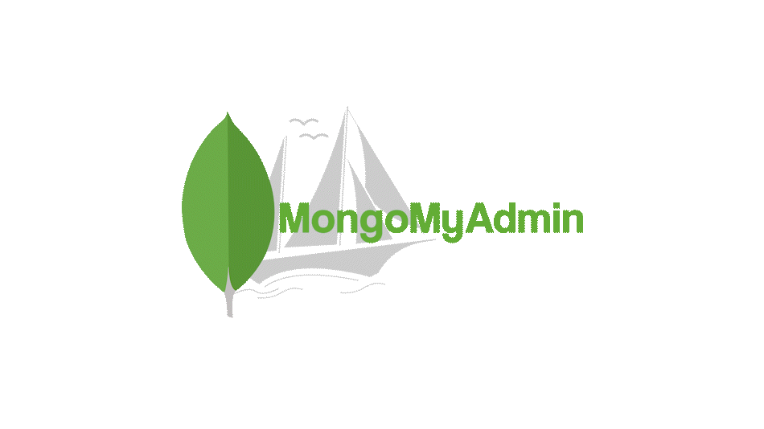

# MongoDB MyAdmin



A modern, lightweight alternative to MongoDB Compass.  
Manage your MongoDB clusters, collections, and documents directly from a clean web interface.  
Built with **Laravel** (API backend) and **React + Vite** (frontend).

---

## ✨ Features

- 🔌 Connect to MongoDB via Driver or Atlas Data API  
- 📂 Browse and manage collections  
- 📄 Create, edit, clone, and delete documents  
- 🔗 Draw relations between documents visually (Canvas mode)  
- 🎨 Customizable preferences:
  - Light/Dark theme
  - Default view (List / Canvas)
  - Canvas grid gap
- 🛠 Developer-friendly setup with `make` commands

---

## 🚀 Getting Started

### Prerequisites
- [Node.js](https://nodejs.org/) (>=18)
- [Composer](https://getcomposer.org/)
- [PHP](https://www.php.net/) (>=8.1)
- [Make](https://www.gnu.org/software/make/) (usually preinstalled on macOS/Linux)

### Installation

Clone the repo and install dependencies:

```bash
git clone https://github.com/yourname/mongodb-myadmin.git
cd mongodb-myadmin
make install
