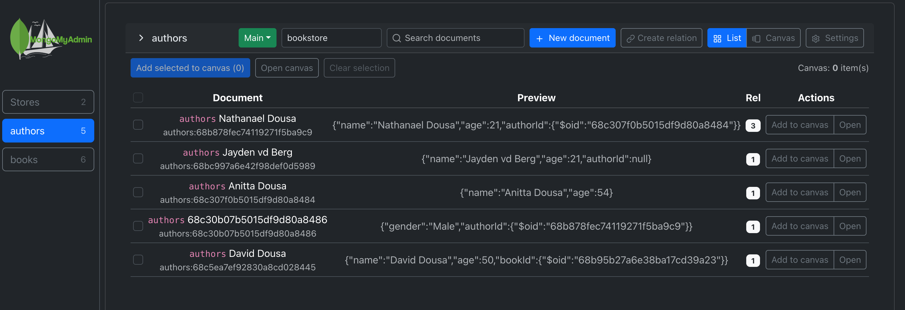
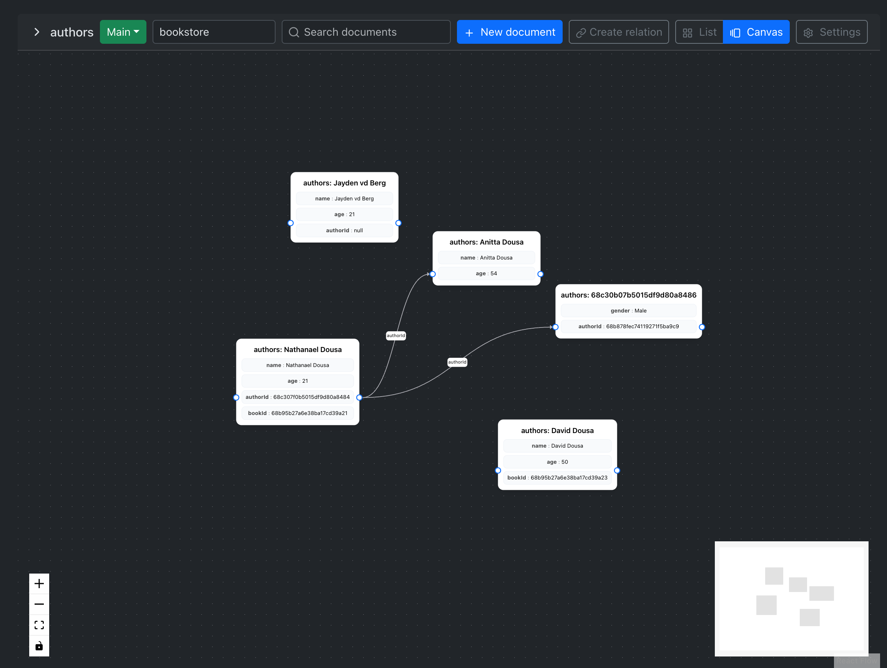

A modern, lightweight alternative to MongoDB Compass.  
Manage your MongoDB clusters, collections, and documents directly from a clean web interface.  
Built with **Laravel** (API backend) and **React + Vite** (frontend).

---

## Features

- 🔌 Connect to MongoDB via Driver or Atlas Data API  
- 📂 Browse and manage collections  
- 📄 Create, edit, clone, and delete documents  
- 🔗 Draw relations between documents visually (Canvas mode)  
- 🎨 Customizable preferences:
  - Light/Dark theme
  - Default view (List / Canvas)
  - Canvas grid gap
- 🛠 Developer-friendly setup with `make` commands

---

## 🚀 Getting Started

### Prerequisites
- [Node.js](https://nodejs.org/) (>=18)
- [Composer](https://getcomposer.org/)
- [PHP](https://www.php.net/) (>=8.1)
- [Make](https://www.gnu.org/software/make/) (usually preinstalled on macOS/Linux)

## Installation

Clone the repo and install dependencies:

```bash
git clone https://github.com/NathanaelDousa/MongodbMyAdmin
cd MongodbMyAdmin
make install
```
## Development

Start both backend (Laravel) and frontend (Vite):
```bash
make dev
```
this will run:
- Backend (Laravel) → http://127.0.0.1:8000
- Frontend (Vite) → http://localhost:5173

Logs are stored in .logs/.
PIDs are tracked in .pids/.

Stop servers cleanly with:
```bash
make stop
```
## Build for production
```bash
make build
```
## Make Commands
| Command                     | Description                                                        |
|-----------------------------|--------------------------------------------------------------------|
| `make install`               | Install dependencies (composer + npm) |
| `make dev`       | Run backend + frontend with logs and PID tracking. |
| `make stop`     | Stop backend and frontend processes. |
| `make restart` | Stop and immediately restart both servers. |
| `make backend `         | Run only the Laravel backend. |
| `make frontend`     | Run only the Vite frontend. |
| `make build`   | Build frontend for production. |
| `make backend-key`| Generate Laravel app key. |
| `make migrate`| Run Laravel migrations. |
| `make fresh`| Fresh migrate with seeding. |
| `make seed`| Seed the database. |
| `make status`| Show running PIDs and open ports. |
| `make logs`| Tail both backend and frontend logs. |
| `make clean-logs`| Clear stored log files. |


## Screenshots
Setup:


List view:


Canvas view:


Settings modal:


## Settings
- Profiles: Manage connection profiles (edit, delete, test)
- App: Theme, default view, grid spacing
- Database: Create, rename, drop collections

## 🤝 Contributing

Pull requests are welcome!
For major changes, please open an issue first to discuss what you would like to change.

## 📄 License

This project is licensed under the MIT License – see the [LICENSE](./LICENSE) file for details.
